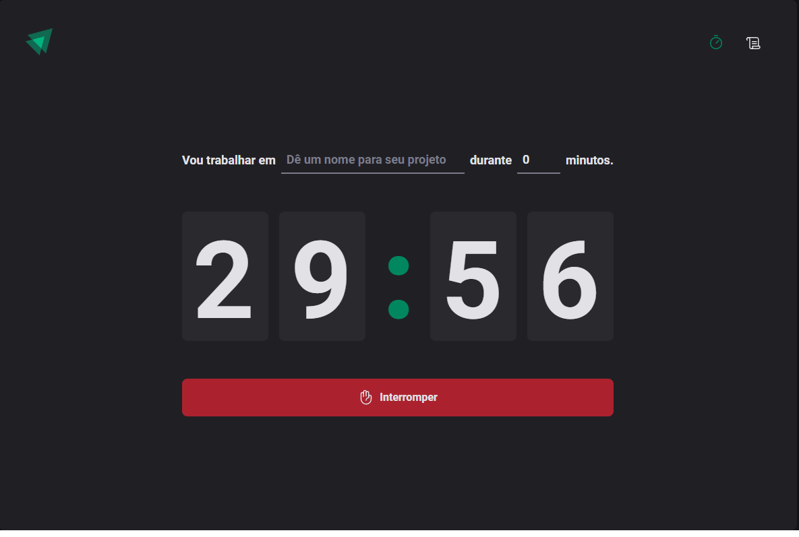
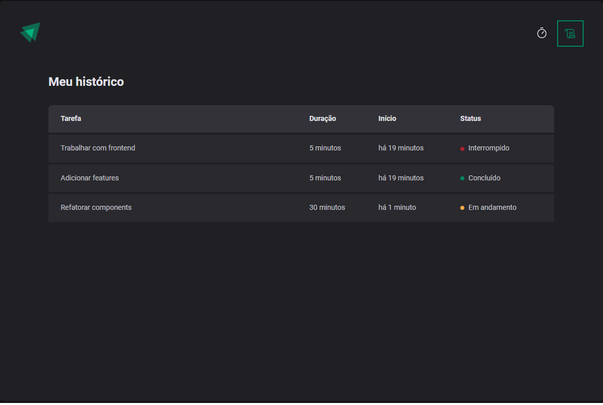

# Ignite-Timer

## 🍅 Aplicação Pomodoro





Aplicação para orgarnizar tempo entre uma atividade à outra.

🛠 Ferramentas usadas na aplicação.

### ° [Typescript](https://github.com/microsoft/TypeScript)
### ° [React Helmet](https://github.com/nfl/react-helmet)
### ° [React Hook Form](https://github.com/react-hook-form/react-hook-form)
### ° [Styled-Components](https://github.com/styled-components/styled-components)
### ° [Zod](https://github.com/colinhacks/zod)


## :zap: Executando o Projeto
#### Clonando o projeto
```sh
$ git clone https://github.com/ElvisFelix-dev/ignite-timer.git
$ cd ignite-timer
$ yarn
$ yarn dev
